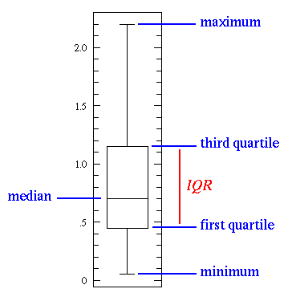

---  
title: "Data Pre-processing and Cleaning in R:Step-by-Step Tutorial"  
author: "Matteo Manca"  
date: "`r format(Sys.Date())`"
output:  
  html_document:  
  keep_md: true  
---  

<!-- 

##Data cleaning
Process of transforming raw data into consistent data that can be analyzed. 
It is aimed at improving the content of statistical statements based on the data as well as their reliability. 


##Raw To Processed Data

- Input: Raw Data (Json, binary, csv, ….)
- Output Tidy Data
- A code book that describes each variable and its values in the tidy dataset 
- Pipeline: a explicit “recipe” used to go from step i to step i+1


##Raw VS Processed Data

#####Raw Data
- Original source of data
- Hard to use for data analyses
- Data analyses includes pre-processing

***Examples of raw data:***

- Binary file resulting from a machine measurement
- Unformatted excel file (received from a company for instance)
- complicated Json file
- …


##Processed Data
- Data ready for analyses
- Merging,subsetting,etc.
- All step should be recorded

***Examples of processed (tiny) data:***

- Each variable you measure should be in one column
- Each different observation (record) should be in a different 
- If we are working with different variables there should be different data frames linked each other


##Special values
*Special values that are exceptions to the normal values of a type:*

- ***NA not available***: NA is a placeholder for a missing value 
- ***NULL:*** You may think of NULL as the empty set from mathematics. NULL is special since it has no class (its class is NULL) and has length 0;
- ***Inf:*** It stands for infinity and only applies to vectors of class numeric. A vector of class integer can never be Inf. This is because the Inf in R is directly derived from the international standard for floating point arithmetic. Technically, Inf is a valid numeric that results from calculations like division of a number by zero; 
- ***NaN (not a number):***  This is generally the result of a calculation of which the result is unknown, but it is surely not a number. In particular operations like 0/0, Inf-Inf and Inf/Inf result in NaN 
-->

##Introduction and usefull functions
- R is case sensitive : ```VARIABLE``` is different from ```variable```
- All R functions have some mandatory parameters and some optional parameters.
- Use ```?function``` or ```help(function)``` to get help for a specified ```function``` ***Each time you need to use a new function, first check how it works and which are all possible parameters***. 
- During the Pre-processing and data cleaning verify often temporary results to see if your doing right 
- ***c(v1,v2,...)***: Create a vector (A vector is a sequence of data elements of the same basic type - numeric, char, etc. )

##Introduction
- Create a directory where you'll store all files of this tutorial (this will be your working directory -WD-)
- Open RStudio
- Create new RScript and save it your directory WD
- Set your working directory

```
setwd("PATH_OF_YOUR_WD")
setwd("C:/Users/User Name/Documents/FOLDER")
```

```{r}
setwd("~/Dropbox/Sync/Research-Projects/Courses/tutorial/")
```

##Datasets
A ***data set*** is a collection of data that describes attribute values (variables) of a number of real-world objects (units).

* Create a new ***data frame*** (In R a data frame is an object used to store data. It is a list of (column) vectors of equal length. 
)
  + create a vector for each column:  `vector <- c(value1, value2, ...) = creates a vector with specified values`
  + create the dataset from the just created vectors


```{r}
person <- c("Matteo","Jhon", "Alice","Maria") #Vector of person names
age <- c(18, NA, 22,15) #Vector of person ages
gender <- c("M","M","F","F")
df1 <- data.frame(person, age, gender) #Create the dataframe with the vecto data
```
##Explore the Datasets
- ***head()/tail()*** Returns the first or last parts of a vector, matrix, table, data frame or function
- ***summary()*** Produce result summaries of the results of various model fitting function
- try the ``?head``` command
```{r}
head(df1)
summary(df1)
```

##Create dataset df2  

* In the same way create a secon data frames containg information about the country of these pesrsons 

```{r}
person <- c("Matteo","Jhon", "Alice","Maria") #Vector of person names
country <- c("IT","US","US","SP")
df2 <- data.frame(person, country) #Create the dataframe with the vecto data
head(df2)
summary(df2)
```

##Merge the two dataset in a unique dataset
Now we have two daasets that contain information of the same persons. We want to crate a uniqie dataset df
```{r}
df <- merge(df1, df2, by = "person")
head(df)
```

##Access a given column/field of the dataframe
There are two main ways:
- using the ```$``` operator
- specifying df[,"field_name"]
- Example
```{r}
df$person
#OR
df[,"person"]
```


##Explore the dataset
* Count how many male and femal there are in our dataframe
```{r}
table(df$gender)
```


##Cleaning dataset

We have a ***missing value*** (see age field)! We can:

- Ignore the record containing the missing value
- Fill the value with the mean (or some other statistic value) 
- Try to predict the missing value
- Apply some heuristic (an approach that employs a practical method not guaranteed to be optimal or perfect, but sufficient for the immediate goals)

##***Fill the missing value with the ```mean```***

- Using the $ we can access a specified column ```col1``` of the dataframe: ```dataframe$col1```
- ``` dataframe$column[is.na(dataframe$column)] ``` select all records in ```dataframe``` that contain NA values in ```column```
- ```mean(vector)``` computes the mean of the values contained in ```vector```

```{r}
#head(df)
df$age[is.na(df$age)] <- mean(df$age)
head(df)
```

SURPRISE!! Nothing happens!!! Why?? 


##Fill the missing value with the ```mean```
In previous slide we were trying to compute the mean of a vector containg also non-numeric value (there is the NA value!!): ``` age ==> 22, NA, 15 , 18 ```

R is not able to do that!!

We need to specify to IGNORE NA values when computing the mean by passing  ```na.rm = TRUE``` to the mean function
```{r}
df$age[is.na(df$age)] <- mean(df$age, na.rm = TRUE)
head(df)
```
Round the age values: ```round(value/vector,NUMBER_OF_DECIMAL_DIGITS)```
```{r}
df$age <- round(df$age,0)
head(df)
```
##Dataframe subsetting
- Select first two rows of the dataframe and all columns
```{r}
df[1:2,]
```
- Select rows 1 and 3 of the dataframe and all columns
```{r}
df[c(1,3),]
```

##Dataframe subsetting
- Select rows 1 and 3 of the dataframe and columns 1 and 3
```{r}
df[c(1,3),c(1,3)]
```

- Select all rows where gender = female

*See function which* ```?which```
```{r}
df[which(df$gender=='F'),]
df[df$gender=='F',]
df[df["gender"]=='F',]
```


##Save the dataframe in a file
We'll save it in a .csv (Coma Separate Value) file
```{r}
write.csv(df, file = "test_df.csv")
```
check if the file is in your WD

##Read dataset from file and load it in a new data frame
- Download data (Electric power consumption) from:
[https://www.dropbox.com/s/2b3tnp9svups3zq/household_power_consumption.txt?dl=0](https://www.dropbox.com/s/2b3tnp9svups3zq/household_power_consumption.txt?dl=0) amd save in in your WD


***Description:*** Measurements of electric power consumption in one household with a one-minute sampling rate over a period of almost 4 years. Different electrical quantities and some sub-metering values are available.

The following descriptions of the 9 variables in the dataset are taken from the UCI web site:

- ***Date***: Date in format dd/mm/yyyy
- ***Time***: time in format hh:mm:ss
- ***Global_active_power***: household global minute-averaged active power (in kilowatt)
- ***Global_reactive_power***: household global minute-averaged reactive power (in kilowatt)
- ***Voltage***: minute-averaged voltage (in volt)
- ***Global_intensity***: household global minute-averaged current intensity (in ampere)
- ***Sub_metering_1***: energy sub-metering No. 1 (in watt-hour of active energy). It corresponds to the kitchen, containing mainly a dishwasher, an oven and a microwave (hot plates are not electric but gas powered).
- ***Sub_metering_2***: energy sub-metering No. 2 (in watt-hour of active energy). It corresponds to the laundry room, containing a washing-machine, a tumble-drier, a refrigerator and a light.
- ***Sub_metering_3***: energy sub-metering No. 3 (in watt-hour of active energy). It corresponds to an electric water-heater and an air-conditioner.
- Note that in this dataset missing values are coded as ?.

##Read data from file
- load the data in a dataframe (functions: read.table, read.csv)

Main parameters of ```read.table``` and ```read.csv```:
- *file:* the name of the file which the data are to be read from.
- *header:*	a logical value indicating whether the file contains the names of the variables as its first line. 
- *sep:* the field separator character. Values on each line of the file are separated by this character.
- *na.strings:*	a character vector of strings which are to be interpreted as NA values.

- first see how the funcion ```read.csv``` works using ```?read.csv```
```{r}
df <- read.csv("household_power_consumption.txt", sep = ';', na.strings = '?', header = T)

```

##Explore dataset
We can use functions like head, summary, dim, etc.
```{r}
head(df)
summary(df)
dim(df) #dimensions of the dataset rows x columns
names(df) ##see the column names of the dataframe
```

##Explore dataset
In addiction to functions we can explore the data also with plots.
Suppose you want to explore the ```Global_active_power``` variable. We can build a box plot to obtain an overview of the values.
A ***boxplot*** is a plot that shows the distribution of data based on the five number summary: minimum, first quartile, median, third quartile, and maximum.



##Explore dataset
```{r}
boxplot(df$Global_active_power)
```

##Rename the column names
```{r}
names(df) <- c("date","time", "active_power", "reactive_power", "Voltage", "intensity", "Sub_met_1", "Sub_met_2", "Sub_met_3")
head(df)
```

##Count the number of distinct date
 See:
 
 - ?length
 - ?unique
```{r}
length(unique(df$date))
```

##Check for duplicates record in the dataset
- if there are duplicates, verify how many
- create a new dataset containg only the duplicates records and save in a .csv file
- remove the duplicates from the original dataset
```{r}
dim(df[duplicated(df), ])
dup_df <- df[duplicated(df), ]
write.csv(dup_df, file="duplicates.csv")
df <- df[!duplicated(df), ]
dim(dup_df)
dim(df)
```

##Check if there are records containing NA values

***```?complete.cases``` Return a logical vector indicating which cases are complete, i.e., have no missing values.***

```{r}
head(complete.cases(df))
dim(df[!complete.cases(df),]) ##NOTE THE "!" that means NOT
```
The result of ``` df[!complete.cases(df),] ``` is a dataframe containing all record with NA

##Check if there are records containing NA values

* Remove all values with NA (in the first toy dataset we used we replace NA with mean)

```{r}
df_withoutna <- df[complete.cases(df),] ##keep just complete records
```
- Verify the obtained result (the dimension of the dataset without NA is equal to dim(original dataframe) - dim(NAs) ?? )
```{r}
dim(df) ##Original datasets
dim(df[!complete.cases(df),]) ##records containing NAs
dim(df_withoutna) ##new datasets without NAs
```

It's a good pratice to make these type of checks to verify if your pre-processing steps are doing well.

##Add column to dataframe
- extract the "month" from the date field and add a column called "month" 
- first convert the date object in the R object used to represent dates ***as.POSIXct function***
- to extract the our use the function ***as.POSIXlt function*** (see ?as.POSIXlt)


```{r}

##The as.POSIXct functions convert the time object to the class used to represent times in R
##df_withoutna$month add a column month to the dataframe
df_withoutna$date <- as.POSIXct(df_withoutna$date, format = "%d/%m/%Y")

##add a field/column called month to the dataframe (remember that now we are working on the new dataframe "df_withoutna")
df_withoutna$month <- format(as.POSIXlt(df_withoutna$date), "%Y-%m") 

#print an overview of the dataset
head(df_withoutna)
```

##Aggregate values
Data can be aggregated in different ways, with different functions (length, mean, etc). 

- ***```?aggregate``` function: ***Splits the data into subsets, computes summary statistics for each, and returns the result in a convenient form.

***EXAMPLE 1 ***
- Compute the average active_power per month (we ae aggregating by month) and save the result ina new dataframe "avg_active_power_xmonth"


```{r}
avg_active_power_xmonth <-  aggregate(active_power ~ month , df_withoutna, FUN=mean)
head(avg_active_power_xmonth)
```


##Aggregate values
***EXAMPLE 2 ***

- Compute the number of active_power measurements per month (So, we are aggregating by month) and save the res in anew df "meas_xmonth"

```{r}
meas_xmonth <-  aggregate(date ~ month , df_withoutna, FUN=length)
names(meas_xmonth) <- c("month","meas_count")
head(meas_xmonth)
```

R do not change the ***column names*** and this, sometimes, can be ***misleading***; in that case it's always better to rename the columns  ( [Rename the column names](#(22)) ). 


##Sort dataframe by a specific column
```{r}
avg_active_power_xmonth <-  avg_active_power_xmonth[order(avg_active_power_xmonth$active_power),]
head(avg_active_power_xmonth)
```

- Sort DESC
```{r}
avg_active_power_xmonth <-  avg_active_power_xmonth[order(-avg_active_power_xmonth$active_power),]
head(avg_active_power_xmonth)
```

##Introduction to outliers

*"An outlier is an observation which deviates so much from the other observations as to arouse suspicions that it was generated by a different mechanism"[Hawkins 1980]*

There exist several ways to discover outliers. 
A first step may be to plot the values to see if there are objects that deviate significantly from the rest of the dataset. 

*Example: See if there are outliers in the active power measurements of our dataset*
```{r}
boxplot(df_withoutna$active_power)
```

For more detalis about the outliers:
[https://www.siam.org/meetings/sdm10/tutorial3.pdf](https://www.siam.org/meetings/sdm10/tutorial3.pdf)


##References

1. https://cran.r-project.org/doc/contrib/de_Jonge+van_der_Loo-Introduction_to_data_cleaning_with_R.pdf
2. https://www.coursera.org/learn/data-cleaning
3. https://www.coursera.org/learn/r-programming
4. http://www.r-bloggers.com
5. [https://github.com/matteomanca/DataScienceSpCourseNotes/blob/master/2_RPROG/R_Programming_Course_Notes.pdf](https://github.com/matteomanca/DataScienceSpCourseNotes/blob/master/2_RPROG/R_Programming_Course_Notes.pdf)
6. [https://www.siam.org/meetings/sdm10/tutorial3.pdf](https://www.siam.org/meetings/sdm10/tutorial3.pdf)